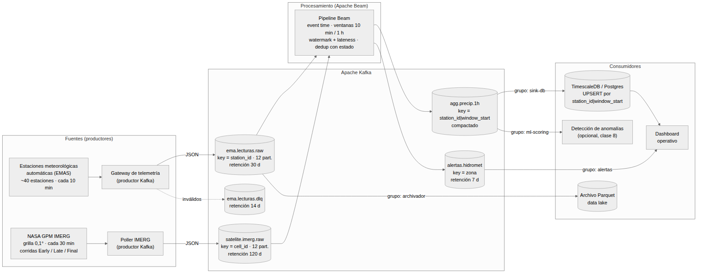

# 1. Caso de uso

Elegí la telemetría hidrometeorológica del Alto Paraná. En el área del embalse de Itaipú hay una
red de estaciones meteorológicas automáticas
(EMAS) que registran cada 10 minutos precipitación, temperatura, humedad,
presión, viento y radiación. Como segunda fuente tomo el producto satelital
GPM IMERG de la NASA, que estima la precipitación en una grilla de 0,1° cada
30 minutos y publica el mismo intervalo tres veces: la corrida *Early* sale a
las ~4 h, la *Late* a las ~14 h y la *Final* unos tres meses después.

Para 2026 hay pronóstico de El Niño, y en Paraguay eso suele significar más
lluvia de lo normal y crecidas del Paraná. Las preguntas que me interesa
contestar casi en tiempo real son bastante concretas: cuánto llovió en la
última hora en cada estación y en cada subcuenca, si alguna estación dejó de
reportar, si lo que mide la estación coincide con lo que estima el satélite y
si corresponde emitir una alerta de lluvia intensa.

## Por qué lo trato como streaming

Una estación que manda un dato cada 10 minutos no parece "tiempo real", y al
principio yo también lo dudé. Pero el conjunto de datos es no acotado: nunca
termina, siempre llegan lecturas nuevas. La frecuencia define cuánta latencia
puedo tolerar, no si el problema es de streaming o no. Además aparecen las
mismas dificultades que vimos en clase. Las estaciones con enlace GPRS o
satelital guardan lecturas cuando pierden señal y las mandan todas juntas al
reconectar, así que llegan tarde y desordenadas. El datalogger reintenta el
envío si no recibe confirmación, lo que genera duplicados. E IMERG corrige el
mismo intervalo tres veces.

El volumen es chico. Con unas 40 estaciones son alrededor de 240 lecturas por
hora, y del lado satelital unas 1 400 celdas sobre Paraguay, dos veces por
hora y tres corridas, dan cerca de 8 400 eventos por hora. Lo difícil acá no
es el throughput sino que el resultado sea correcto en el tiempo.

## Eventos principales

| Evento | Origen | Cadencia | Contenido |
|-----------|------------------|---------------|----------------------------|
| `ema.lectura` | Datalogger de cada estación, vía gateway | 10 min por estación | `station_id`, `event_time`, variables meteorológicas, `seq`, flags de calidad |
| `satelite.imerg` | Poller que descarga IMERG de GES DISC | 30 min por celda, 3 corridas | `cell_id`, `interval_start`, `precip_mm_h`, `run` (EARLY, LATE o FINAL) |
| `agg.precip.1h` | Pipeline Beam (derivado) | por ventana horaria y estación | `station_id`, `window_start`, `precip_mm`, `n_lecturas`, `pane` |
| `alerta.hidromet` | Pipeline Beam (derivado) | cuando se supera un umbral | `zona`, `tipo`, `umbral`, `valor`, `window_start` |

En [`ejemplo_evento.json`](ejemplo_evento.json) está un evento `ema.lectura`
completo. Hay cuatro decisiones de esquema que conviene explicar. El
`event_id` se arma a partir de la estación y la hora de medición
(`ema-<station>-<event_time>`), así que si el datalogger reenvía la misma
lectura, el id se repite y se puede deduplicar sin preguntarle nada al
productor. Separé `event_time` (cuándo midió el sensor) de `arrival_time`
(cuándo lo recibió el gateway), porque sin esa diferencia no puedo medir el
atraso ni asignar bien las ventanas. El campo `seq` crece de a uno por
estación y sirve para detectar lecturas perdidas. Y `schema_version` permite
cambiar el esquema más adelante sin romper a los consumidores.

# 2. Arquitectura y tópicos



| Tópico | Propósito | Clave | Part. | Retención | Limpieza |
|-------------|------------------------------------------|-----------|----:|-----------|---------|
| `ema.lecturas.raw` | Lecturas tal como llegaron. Es la fuente de cualquier reprocesamiento. | `station_id` | 12 | 30 días | `delete` |
| `ema.lecturas.dlq` | Eventos que no pasan la validación (JSON roto, timestamp inválido, valor fuera de rango físico). | `station_id` | 3 | 14 días | `delete` |
| `satelite.imerg.raw` | Estimaciones IMERG por celda y corrida. | `cell_id` | 12 | 120 días | `delete` |
| `agg.precip.1h` | Salida del pipeline: acumulado horario por estación. Cada pane pisa al anterior. | `station_id|window_start` | 12 | sin límite (compactado) | `compact` |
| `alertas.hidromet` | Alertas para el dashboard y las notificaciones. | `zona` | 3 | 7 días | `delete` |

Mantengo los datos crudos separados de los derivados. El tópico raw no se
modifica nunca y dura lo suficiente como para reprocesar, y todo lo derivado
se puede volver a calcular desde ahí; en eso se apoya el replay. Los eventos
inválidos van a una DLQ en vez de descartarse: si un sensor tiene la hora mal
configurada y manda timestamps del futuro, prefiero tenerlos a mano para
diagnosticar el problema antes que perderlos o, peor, dejarlos entrar a las
ventanas.

IMERG retiene 120 días porque la corrida *Final* llega unos tres meses tarde,
y para ese momento todavía quiero poder cruzarla con las corridas anteriores
del mismo intervalo. Para cruces más viejos está el archivo en Parquet. El
tópico de agregados, en cambio, es compactado. Como el pipeline emite panes
acumulativos, de cada clave `station_id|window_start` sólo me importa el
último mensaje, y con la compactación el tópico termina funcionando como una
tabla idempotente.

# 3. Clave de particionamiento

Uso `station_id` para las lecturas de las estaciones y `cell_id` para
IMERG. La razón principal es el orden: Kafka sólo lo garantiza dentro de una
partición, y con esta clave todas las lecturas de una estación caen en la
misma. Así un consumidor ve la secuencia de cada estación tal como se
publicó, puede detectar huecos con `seq` y deduplicar con estado por clave
sin coordinarse con otros workers.

Hay dos razones más. Las ventanas se calculan por estación, y si la clave de
partición coincide con la de agregación me ahorro un *shuffle* en el
pipeline. Y la carga queda pareja: todas las estaciones emiten con la misma
frecuencia, así que 40 claves sobre 12 particiones son 3 o 4 estaciones por
partición, sin claves calientes. Con 12 particiones además puedo triplicar la
red sin reparticionar y tener hasta 12 consumidores en paralelo por grupo.

Descarté tres alternativas. Sin clave (round-robin) la carga se reparte mejor,
pero pierdo el orden por estación y la deduplicación necesitaría estado
global. Por `cuenca` o `zona` quedan muy pocas claves, así que pocas
particiones trabajan y aparecen claves calientes. Por `event_time` se rompe el
orden y toda la carga se concentra en la partición "actual".

El tópico de agregados es la excepción: ahí la clave es
`station_id|window_start`. La compactación guarda el último mensaje de cada
clave, y si la clave fuera sólo `station_id` el tópico se quedaría con una
única ventana por estación. Con la clave compuesta, todos los panes de una
misma ventana caen en la misma partición y llegan en orden, que es lo único
que necesita el sink para quedarse con la versión más nueva.

Hay un detalle que me costó entender al principio: la clave garantiza orden
de publicación, no de tiempo de evento. Si una estación reenvía lecturas
atrasadas, las publica después de otras más nuevas. Ese desorden no lo
arregla Kafka; lo resuelve el procesamiento con ventanas por `event_time` y
watermark. Por eso el evento lleva `event_time` explícito.

# 4. Productores y consumidores

## Productores

| Productor | Publica en | Semántica | Notas |
|-----------|--------------|------------------|--------------------------------|
| Gateway de telemetría | `ema.lecturas.raw`, `ema.lecturas.dlq` | `acks=all`, `enable.idempotence=true`, `event_id` determinista | Valida esquema y rangos físicos y sella `arrival_time`. Es el único punto de entrada de las estaciones. |
| Poller IMERG | `satelite.imerg.raw` | `acks=all`, idempotente | Consulta GES DISC cada 30 min y publica una entrada por celda dentro del área de Paraguay (unas 1 400). Cada corrida se publica como evento nuevo con el mismo `interval_start`. |
| Pipeline Beam | `agg.precip.1h`, `alertas.hidromet` | `acks=all` | Es consumidor y productor a la vez; publica cada pane con `pane_timing` y `pane_index`. |

Hay dos tipos de duplicado y conviene no mezclarlos. `enable.idempotence`
evita los que genera el propio productor cuando reintenta. Los que genera el
datalogger al reenviar una lectura llegan como mensajes nuevos, y esos sólo
se pueden filtrar más adelante, gracias al `event_id` determinista.

## Consumidores

| Grupo de consumidores | Lee de | Qué hace | Aislamiento |
|-------------|--------------|------------------------------------|------------------|
| `beam-agg` | `ema.lecturas.raw`, `satelite.imerg.raw` | Pipeline Beam: ventanas por tiempo de evento (10 min y 1 h), watermark, lateness, deduplicación con estado, comparación estaciones vs. IMERG, umbrales de alerta. | Offsets propios. |
| `sink-db` | `agg.precip.1h` | UPSERT en TimescaleDB por `station_id|window_start`; cada pane reemplaza la fila. | Puede reiniciarse desde el inicio del tópico compactado. |
| `alertas` | `alertas.hidromet` | Dashboard y notificaciones. | Sólo le interesan los últimos 7 días. |
| `ml-scoring` (opcional) | `agg.precip.1h` | Detección de anomalías por estación (clase 8). | Se puede pausar sin afectar a nadie. |
| `archivador` | `ema.lecturas.raw`, `satelite.imerg.raw` | Guarda Parquet particionado por día en el data lake. | Es la copia de largo plazo y permite replays más allá de la retención. |

Cada grupo lleva sus propios offsets. Si agrego el consumidor de ML no toco
ni el sink ni el dashboard, y si un consumidor se cae, retoma desde el último
offset que confirmó. Para mí esa es la ventaja más clara de usar un log en el
medio.

# 5. Retención y escenario de replay

## Retención

`ema.lecturas.raw` guarda 30 días (`retention.ms`), con un tope por tamaño
(`retention.bytes`) por las dudas. Elegí 30 días porque cubren el tiempo que
suele pasar hasta que alguien detecta un error de procesamiento, y porque una
estación que estuvo un mes sin enlace todavía puede volcar sus lecturas sin
que se hayan borrado. `satelite.imerg.raw` guarda 120 días por lo de la
corrida *Final*. `agg.precip.1h` no se limpia por tiempo sino por
compactación: queda la última versión de cada clave, y un consumidor nuevo
puede reconstruir la tabla completa leyendo desde el principio. Para
reprocesar más atrás de esos plazos está el archivo Parquet, que se puede
volver a publicar en el tópico raw.

## Escenario de replay

Supongamos que el día 12 se descubre un error doble: el control de calidad del
gateway dejaba pasar ráfagas imposibles (más de 60 m/s) y el pipeline sumaba
cero cuando faltaban lecturas, en lugar de interpolar. Los resultados de los
últimos 9 días en `agg.precip.1h` están mal.

El procedimiento sería este:

1. Corrijo el pipeline y lo despliego con un grupo de consumidores nuevo,
   `beam-agg-v2`. El v1 puede seguir corriendo hasta que valide el nuevo.
2. Muevo los offsets de `beam-agg-v2` al momento desde el que quiero
   reprocesar:

   ```bash
   kafka-consumer-groups --bootstrap-server kafka:9092 \
     --group beam-agg-v2 --topic ema.lecturas.raw \
     --reset-offsets --to-datetime 2026-09-03T00:00:00.000 --execute
   ```

3. El pipeline vuelve a procesar los 9 días leyendo el mismo log que produjo
   los resultados erróneos. No hace falta pedirle nada a las estaciones.
4. Cada ventana recalculada se publica en `agg.precip.1h` con la misma clave
   `station_id|window_start`. Como el tópico es compactado y el sink hace
   UPSERT, la versión corregida reemplaza a la vieja; no quedan filas
   duplicadas ni hay que borrar a mano.
5. Comparo contra una muestra, apunto el dashboard al resultado del v2 y doy
   de baja el grupo v1.

Esto funciona porque se combinan tres decisiones. El raw no cambia y dura más
que el tiempo en que se detecta un error. Los eventos traen `event_time`, así
que las ventanas son las mismas aunque el reprocesamiento ocurra días
después. Y la salida es idempotente por clave, así que reprocesar es seguro
aunque el pipeline sólo garantice *at-least-once*. Si faltara la tercera, el
replay duplicaría totales; si faltara la segunda, los eventos caerían en las
ventanas del día del replay; y si faltara la primera, directamente no habría
nada que reprocesar.

Hay además un replay que no depende de ningún error y que va a pasar siempre:
cuando llega la corrida *Final* de IMERG, unos tres meses después, el
pipeline vuelve a leer las lecturas de las estaciones de ese período para
recalcular la comparación entre tierra y satélite. Es el mismo mecanismo,
sólo que lo dispara la llegada de datos nuevos.

# 6. Resumen de decisiones

| Decisión | Motivo |
|---|---|
| `event_time` y `arrival_time` separados | Ventanas correctas y medición del atraso |
| `event_id` determinista | Deduplicar sin coordinar con el productor |
| Clave `station_id` | Orden por estación, carga pareja, misma clave que la agregación |
| Raw inmutable y derivados compactados | Replay seguro e idempotente |
| DLQ | Diagnosticar sin contaminar las ventanas |
| Retención de 30 y 120 días | Tiempo para detectar errores y para la corrida *Final* de IMERG |
| Un grupo de consumidores por función | Agregar o reiniciar un consumidor no afecta a los demás |

# Anexo: productor y consumidor mínimos (opcional)

En [`demo/`](demo/) dejé un `docker-compose.yml` con Kafka 4.1.1 en modo KRaft
(la imagen oficial `apache/kafka`), un productor que simula 4 estaciones (con
duplicados y atrasos a propósito) y un consumidor que imprime cada lectura con
su atraso. Las instrucciones están en [`demo/README.md`](demo/README.md) y la
salida de una corrida con las herramientas de consola, en
[`demo/evidencia_ejecucion.txt`](demo/evidencia_ejecucion.txt).
