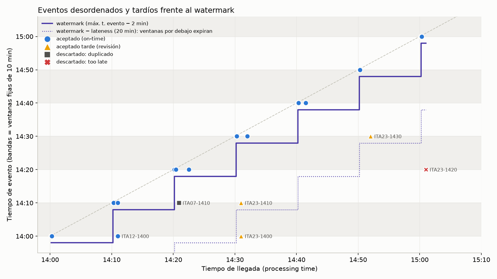

# 0. Contexto y secuencia analizada

Sigo con el caso de la Tarea 1: estaciones meteorológicas automáticas que
miden precipitación cada 10 minutos y publican en `ema.lecturas.raw`. Lo que
quiero calcular es el acumulado de lluvia por ventana de 10 minutos, que
después alimenta las alertas de lluvia intensa y la comparación con IMERG.

Para el análisis armé una secuencia con cuatro estaciones que tienen enlaces
de distinta calidad, porque en la práctica eso es lo que genera el desorden:

| Estación | Enlace | Comportamiento |
|---|---|---|
| ITA01, ITA07 | fibra | llegan en segundos |
| ITA12 | GPRS | junta lecturas y las manda en ráfaga; entre 1 y 11 min de atraso |
| ITA23 | satelital | entre 20 y 40 min de atraso, a veces más |
| ITA07 | (datalogger) | reenvía una lectura que no recibió confirmación, o sea, un duplicado |

La tabla de abajo tiene los 24 eventos en orden de llegada, con la
ventana que le corresponde a cada uno, cómo queda el watermark después de
procesarlo y qué decisión se toma. No calculé las tablas a mano: las generan
[`simulacion.py`](simulacion.py) y [`generar_doc.py`](generar_doc.py), que
imitan la semántica de Beam sin usar Beam. Así, si cambio un parámetro, el
documento se regenera solo y los números no quedan desfasados del texto.

| event_id | t. evento | t. llegada | atraso (min) | ventana asignada | watermark | decisión |
|---|---|---|---|---|---|---|
| ITA01-1400 | 14:00 | 14:00:12 | 0.2 | [14:00, 14:10) | 13:58 | on-time |
| ITA07-1400 | 14:00 | 14:00:18 | 0.3 | [14:00, 14:10) | 13:58 | on-time |
| ITA01-1410 | 14:10 | 14:10:12 | 0.2 | [14:10, 14:20) | 14:08 | on-time |
| ITA07-1410 | 14:10 | 14:10:18 | 0.3 | [14:10, 14:20) | 14:08 | on-time |
| ITA12-1400 | 14:00 | 14:11 | 11.0 | [14:00, 14:10) | 14:08 | on-time |
| ITA12-1410 | 14:10 | 14:11 | 1.0 | [14:10, 14:20) | 14:08 | on-time |
| ITA01-1420 | 14:20 | 14:20:12 | 0.2 | [14:20, 14:30) | 14:18 | on-time |
| ITA07-1420 | 14:20 | 14:20:24 | 0.4 | [14:20, 14:30) | 14:18 | on-time |
| ITA07-1410 | 14:10 | 14:20:54 | 10.9 | [14:10, 14:20) | 14:18 | duplicado |
| ITA12-1420 | 14:20 | 14:22:30 | 2.5 | [14:20, 14:30) | 14:18 | on-time |
| ITA01-1430 | 14:30 | 14:30:12 | 0.2 | [14:30, 14:40) | 14:28 | on-time |
| ITA07-1430 | 14:30 | 14:30:18 | 0.3 | [14:30, 14:40) | 14:28 | on-time |
| ITA23-1400 | 14:00 | 14:31 | 31.0 | [14:00, 14:10) | 14:28 | late (revisión) |
| ITA23-1410 | 14:10 | 14:31 | 21.0 | [14:10, 14:20) | 14:28 | late (revisión) |
| ITA12-1430 | 14:30 | 14:32 | 2.0 | [14:30, 14:40) | 14:28 | on-time |
| ITA01-1440 | 14:40 | 14:40:12 | 0.2 | [14:40, 14:50) | 14:38 | on-time |
| ITA07-1440 | 14:40 | 14:40:18 | 0.3 | [14:40, 14:50) | 14:38 | on-time |
| ITA12-1440 | 14:40 | 14:41:30 | 1.5 | [14:40, 14:50) | 14:38 | on-time |
| ITA01-1450 | 14:50 | 14:50:12 | 0.2 | [14:50, 15:00) | 14:48 | on-time |
| ITA07-1450 | 14:50 | 14:50:18 | 0.3 | [14:50, 15:00) | 14:48 | on-time |
| ITA23-1430 | 14:30 | 14:52 | 22.0 | [14:30, 14:40) | 14:48 | late (revisión) |
| ITA01-1500 | 15:00 | 15:00:12 | 0.2 | [15:00, 15:10) | 14:58 | on-time |
| ITA07-1500 | 15:00 | 15:00:18 | 0.3 | [15:00, 15:10) | 14:58 | on-time |
| ITA23-1420 | 14:20 | 15:01 | 41.0 | [14:20, 14:30) | 14:58 | too_late |

Notas sobre los eventos marcados:

- `ITA12-1400`: llega en una ráfaga GPRS, 11 min después de medir.
- `ITA12-1410`: viene en la misma ráfaga.
- `ITA07-1410`: el datalogger la reenvía (duplicado).
- `ITA23-1400`: llega por satélite, todavía dentro de la tolerancia.
- `ITA23-1410`: llega por satélite, todavía dentro de la tolerancia.
- `ITA23-1430`: llega por satélite, todavía dentro de la tolerancia.
- `ITA23-1420`: llega por satélite cuando su ventana ya expiró.

# 1. Elección del tiempo de evento

Uso `event_time`, el instante en que midió el sensor, y no el momento en que
llega el dato.

La lluvia de 14:00 a 14:10 cayó en ese intervalo aunque el dato llegue a las
14:31. Si ventaneara por tiempo de llegada, la ráfaga de ITA12 de las 14:11
(que trae una lectura de las 14:00 y otra de las 14:10) caería entera en la
ventana de 14:10, y los 0,2 mm que ITA23 midió a las 14:00 se contarían a las
14:30. El resultado dependería de qué tan bueno es el enlace de cada estación,
y además no sería reproducible: si hago replay del mismo log al día siguiente,
obtengo otros totales.

Con tiempo de evento el resultado depende de los datos y no de cómo llegaron.
El mismo log da las mismas ventanas hoy, mañana o en un replay. Lo que pago a
cambio es tener que decidir cuándo una ventana está lo bastante completa como
para emitir, y de eso se encarga el watermark.

Esto obliga a que cada evento traiga dos tiempos: `event_time`, que pone el
datalogger, y `arrival_time`, que pone el gateway. Sin los dos no puedo medir
atrasos ni detectar qué estación anda mal.

# 2. Tipo y configuración de ventana

Uso ventanas fijas (tumbling) de 10 minutos alineadas al reloj: `[14:00,
14:10)`, `[14:10, 14:20)`, etc.

Descarté las ventanas deslizantes porque el acumulado de lluvia se suma, y con
ventanas que se solapan la misma lectura contaría más de una vez. Las
deslizantes me servirían para otra cosa, por ejemplo una media móvil de
temperatura de 30 minutos que avance cada 10. Tampoco tienen sentido las
ventanas de sesión: se definen por períodos de inactividad y están pensadas
para usuarios, mientras que una estación emite a intervalos fijos.

Elegí 10 minutos porque es la frecuencia de las estaciones, y entonces cada
ventana tiene exactamente una lectura por estación. Esa salida también sirve
de base para agregar después a 1 hora o a 24 horas. El inicio de cada ventana
se calcula como `floor(t / 600 s) × 600 s`, igual que `FixedWindows` en Beam,
así dos workers asignan la misma ventana a un evento sin tener que ponerse de
acuerdo.

# 3. Watermark y lateness permitida

## Watermark

El watermark es heurístico: `max(event_time visto) - 2 min`, y nunca
retrocede. Los 2 minutos de holgura alcanzan para las estaciones con buen
enlace, que llegan en segundos (ITA01, ITA07 e ITA12 cuando anda bien). No
intento cubrir a ITA23. Para eso necesitaría 40 minutos de holgura, y estaría
atrasando todas las ventanas 40 minutos para proteger a una sola estación.

En Beam este watermark lo da la fuente: en el SDK de Java, `KafkaIO` con
`withTimestampPolicy` o `CustomTimestampPolicyWithLimitedDelay`; en el SDK de
Python, `ReadFromKafka` con la política `CreateTime`, que toma el timestamp
del mensaje como tiempo de evento. En la simulación avanza cada vez que se
procesa un evento. En la tabla se ve bien: cuando llega `ITA01-1420`
(14:20:12) el watermark pasa a 14:18, y cuando llega `ITA01-1430` pasa a
14:28, supera el final de `[14:10, 14:20)` y se dispara el pane on-time de esa
ventana.

Hay una trampa que la simulación no muestra y que en Kafka sí aparece: las
particiones ociosas. `KafkaIO` calcula un watermark por partición y el del
pipeline es el mínimo de todos. Si una partición deja de recibir datos, por
ejemplo porque las 3 o 4 estaciones que caen en ella se quedaron sin enlace,
su watermark no avanza y frena el cierre de las ventanas de toda la red. Para
que eso no pase, la política de timestamps de la fuente tiene que dejar
avanzar el watermark de una partición sin datos, que es lo que hace
`CustomTimestampPolicyWithLimitedDelay`: si la partición está vacía, toma la
hora actual menos el atraso máximo. La estación callada tampoco puede pasar
inadvertida, así que la marco con una alerta aparte de "estación sin
reportar", que es una de las preguntas del caso.

## Lateness permitida

`allowed_lateness = 20 min`, contados desde el final de la ventana. La ventana
`[14:00, 14:10)` sigue aceptando datos tardíos hasta que el watermark pase de
14:30. Después expira y se libera su estado.

Saqué los 20 minutos de cómo se comporta ITA23: llega entre 20 y 31 minutos
después de medir, que son entre 10 y 21 minutos después del cierre de la
ventana. Con ese valor entran como revisión `ITA23-1400`, `ITA23-1410` e
`ITA23-1430`. En operación no fijaría ese valor a ojo sino con la
distribución real del atraso: la auditoría guarda `arrival_time - event_time`
de cada lectura, y la lateness tiene que cubrir el p99 por estación, no el
promedio, que esconde la cola de las satelitales. Cada ventana vive como
mucho 30 minutos (10 propios más 20 de tolerancia), así que en memoria hay
unas 3 ventanas abiertas por estación. Y
el límite queda claro: `ITA23-1420` llega a las 15:01, cuando el watermark
(14:58) ya pasó de 14:30 más 20 minutos, así que se descarta. Pero no
desaparece: queda en la auditoría como `too_late` y cuenta para la métrica de
salud de esa estación.

## Duplicados

Junto con la política temporal aplico deduplicación por `event_id` dentro de
cada estación y ventana. `ITA07-1410` se reenvía a las 14:20:54 con un
`event_time` válido y dentro de la tolerancia, pero ya se había contado, así
que se descarta como `duplicado` antes de tocar el acumulado. Los ids vistos
se borran cuando expira la ventana.

# 4. Cómo leer los resultados parciales

Con esta política salen 17 panes para 24 eventos:
7 early, uno on-time por ventana y 3 late.

| ventana | pane | emitido a las | acumulado (mm) | lecturas |
|---|---|---|---|---|
| [14:00, 14:10) | EARLY | 14:05:12 | 0.4 | 2 |
| [14:00, 14:10) | EARLY | 14:16 | 1.0 | 3 |
| [14:10, 14:20) | EARLY | 14:15:12 | 7.1 | 3 |
| [14:00, 14:10) | ON_TIME | 14:20:12 | 1.0 | 3 |
| [14:20, 14:30) | EARLY | 14:25:12 | 13.5 | 3 |
| [14:10, 14:20) | ON_TIME | 14:30:12 | 7.1 | 3 |
| [14:00, 14:10) | LATE | 14:31 | 1.2 | 4 |
| [14:10, 14:20) | LATE | 14:31 | 9.3 | 4 |
| [14:30, 14:40) | EARLY | 14:35:12 | 20.3 | 3 |
| [14:20, 14:30) | ON_TIME | 14:40:12 | 13.5 | 3 |
| [14:40, 14:50) | EARLY | 14:45:12 | 8.0 | 3 |
| [14:30, 14:40) | ON_TIME | 14:50:12 | 20.3 | 3 |
| [14:30, 14:40) | LATE | 14:52 | 25.8 | 4 |
| [14:50, 15:00) | EARLY | 14:55:12 | 1.4 | 2 |
| [14:40, 14:50) | ON_TIME | 15:00:12 | 8.0 | 3 |
| [14:50, 15:00) | ON_TIME (cierre) | 15:02 | 1.4 | 2 |
| [15:00, 15:10) | ON_TIME (cierre) | 15:02 | 0.0 | 2 |

Los panes early (`AfterProcessingTime(5 min)` desde el primer elemento del
pane) son estimaciones provisorias con lo que haya llegado hasta el momento.
El early de `[14:00, 14:10)` a las 14:05:12 dice 0,4 mm con 2 estaciones; a
las 14:16, cuando ya llegó ITA12, dice 1,0 mm con 3. Es lo que mostraría el
dashboard en vivo, y conviene presentarlo como parcial, por ejemplo mostrando
cuántas estaciones reportaron.

El pane on-time (`AfterWatermark`) se emite cuando el watermark cruza el
final de la ventana. Es la mejor estimación según el watermark, no un
resultado final: como el watermark es heurístico, ese valor todavía puede
corregirse con panes late hasta que la ventana expira. Sobre ese pane
evaluaría los umbrales de alerta. A las 14:20:12, `[14:00, 14:10)` cierra con 1,0 mm y 3 de
4 estaciones.

Los panes late (`AfterCount(1)` después del on-time) son correcciones.
`ITA23-1400` llega a las 14:31 y `[14:00, 14:10)` se vuelve a emitir con 1,2
mm y las 4 estaciones. El consumidor tiene que tomar cada late como un
reemplazo del valor anterior, no como un dato nuevo.

Dentro de una misma ventana, la secuencia early, on-time, late nunca pierde
información: cada pane sabe por lo menos lo que sabía el anterior. La columna
`lecturas` indica qué tan completo está cada uno.

## Resultado final y eventos descartados

| ventana | total final (mm) | lecturas |
|---|---|---|
| [14:00, 14:10) | 1.2 | 4 |
| [14:10, 14:20) | 9.3 | 4 |
| [14:20, 14:30) | 13.5 | 3 |
| [14:30, 14:40) | 25.8 | 4 |
| [14:40, 14:50) | 8.0 | 3 |
| [14:50, 15:00) | 1.4 | 2 |
| [15:00, 15:10) | 0.0 | 2 |

De los 24 eventos se aceptaron 22 (3 como revisión
late), se descartó 1 duplicado y 1 por `too_late`. Este último
es `ITA23-1420`: sus 3,8 mm no entran en `[14:20, 14:30)`, que queda en 13,5
mm con 3 estaciones. La pérdida está a la vista, porque el pane final de esa
ventana dice 3 lecturas en vez de 4 y la auditoría guarda el evento.

# 5. Modo de acumulación y contrato de salida

Uso `ACCUMULATING`: cada pane trae el total de la ventana, no lo que cambió
desde el anterior. Por eso el late de `[14:10, 14:20)` dice 9,3 mm y no
"+2,2 mm".

Con `DISCARDING` cada pane trae sólo lo nuevo, y el consumidor tiene que ir
sumando. El problema es que si un pane se procesa dos veces por un reintento,
el total queda inflado. Sólo lo usaría si el destino fuera un contador capaz
de sumar de forma idempotente. Existe también `ACCUMULATING_AND_RETRACTING`,
que manda el total nuevo más una retracción del anterior, pero el SDK de
Python de Beam no lo soporta y acá no lo necesito.

## Contrato de salida

Cada mensaje de la salida de 10 minutos (`agg.precip.10min`, la versión de 10
minutos de `agg.precip.1h` de la Tarea 1) trae:

| Campo | Contenido |
|---|---|
| `station_id`, `window_start`, `window_end` | identifican la ventana; la clave lógica es `station_id|window_start` |
| `precip_mm`, `n_lecturas` | valor acumulado y cuántas lecturas lo forman |
| `pane_timing` (EARLY, ON_TIME o LATE) | qué tipo de resultado es |
| `pane_index` | número de pane dentro de la ventana (0, 1, 2...) |
| `is_final` | `true` cuando la ventana expiró y ya no va a cambiar |
| `emitted_at` | momento de emisión (processing time) |

Lo que le garantizo al consumidor:

1. Puede escribir con `UPSERT` por `station_id|window_start`. Con
   `pane_index` puede ignorar un pane viejo que llegue después de uno nuevo
   por culpa de un reintento.
2. El resultado de una ventana puede cambiar hasta 30 minutos después de que
   termina. Las alertas se evalúan con el on-time y se vuelven a evaluar con
   cada late; los informes diarios usan sólo los que tienen `is_final = true`.
3. Siempre sabe qué tan completo está el dato, porque `n_lecturas` viene con
   el valor. Para un uso puede exigir 4 de 4 y para otro aceptar 3 de 4.
4. Nada se pierde sin aviso: los `too_late` van a un tópico de auditoría con
   su atraso, que sirve para vigilar las estaciones.

# 6. Latencia, completitud y costo: qué pasa con otras políticas

Corrí la misma secuencia con cuatro políticas, siempre con deduplicación:

| ventana | propuesta (evento, lateness 20) | lateness 0 | lateness ∞ | ventanas por t. de llegada |
|---|---|---|---|---|
| [14:00, 14:10) | 1.2 | 1.0 | 1.2 | 0.4 |
| [14:10, 14:20) | 9.3 | 7.1 | 9.3 | 7.7 |
| [14:20, 14:30) | 13.5 | 13.5 | 17.3 | 13.5 |
| [14:30, 14:40) | 25.8 | 20.3 | 25.8 | 22.7 |
| [14:40, 14:50) | 8.0 | 8.0 | 8.0 | 8.0 |
| [14:50, 15:00) | 1.4 | 1.4 | 1.4 | 6.9 |
| [15:00, 15:10) | 0.0 | 0.0 | 0.0 | 3.8 |

Con lateness 0 la latencia no cambia, pero las tres lecturas satelitales que
llegan entre 20 y 31 minutos tarde se pierden. `[14:00, 14:10)` queda en 1,0
mm en vez de 1,2; `[14:10, 14:20)` en 7,1 en vez de 9,3; y `[14:30, 14:40)`
en 20,3 en vez de 25,8. Sale más barato, porque no hay estado después del
cierre, ni panes late, ni UPSERT, pero la estación satelital desaparece de los
acumulados todo el tiempo, y eso sesga la comparación con IMERG justo en la
zona que cubre esa estación.

Con lateness infinita no se descarta nada y hasta se recupera `ITA23-1420`
(17,3 mm en `[14:20, 14:30)`). El problema es que las ventanas no expiran
nunca. Con 40 estaciones y 144 ventanas por día el estado crece sin límite, y
cualquier ventana vieja puede seguir cambiando, lo cual rompe la garantía 2:
un informe cerrado dejaría de estar cerrado.

Si ventaneo por tiempo de llegada, la latencia es mínima y no necesito estado
ni tolerancia, pero los totales dejan de representar la lluvia real. La
ráfaga de ITA12 mueve 0,6 mm de las 14:00 a las 14:10. `[14:30, 14:40)` suma
22,7 mm con lecturas que en realidad son de las 14:00, 14:10 y 14:30. Y los
3,8 mm de `ITA23-1420` aparecen en `[15:00, 15:10)`, cuarenta minutos después
de haber caído. Encima, un replay daría otros números.

Si saco los panes early, el primer resultado tarda unos 12 minutos (fin de
ventana más 2 de holgura) en lugar de 5. Me ahorro escrituras, porque en esta
secuencia 7 de los 17 panes son early, y para un informe
diario estaría bien. Para el dashboard no.

En resumen, esto es lo que acepto con la política elegida:

| Aspecto | Decisión | Lo que cuesta |
|---|---|---|
| Latencia | early a los 5 min, on-time al cierre más 2 min | resultados provisorios que después cambian |
| Completitud | 20 min de lateness, que cubren a ITA23 en condiciones normales | ITA23 pierde lecturas cuando se atrasa más de 30 min |
| Costo | estado de hasta 30 min por ventana; unos 2 panes extra por ventana | un destino con UPSERT y consumidores que entiendan `pane_timing` |

El compromiso entre latencia, completitud y costo no desaparece con esta
política, pero queda explícito y se puede ajustar. La holgura del watermark,
la lateness y la frecuencia de los early son tres constantes del pipeline, y
las puedo recalibrar con los atrasos que registra la propia auditoría.
