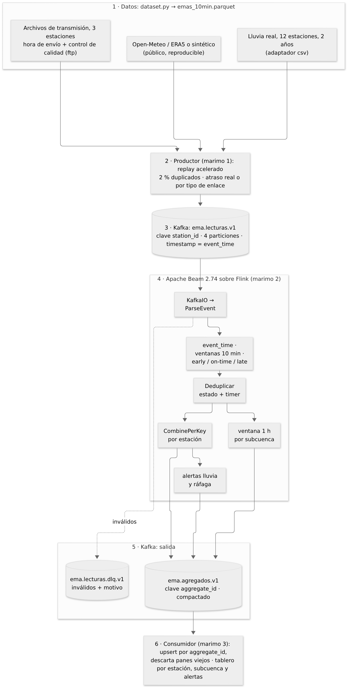

# Trabajo práctico final: telemetría hidrometeorológica en streaming

Kafka, Apache Beam, Flink y Marimo. *Streaming de datos y sus aplicaciones*,
MIAAD FP-UNA. Autor: `abarchello`.

Este proyecto toma lecturas históricas de estaciones meteorológicas
automáticas de Alto Paraná y Canindeyú y las reproduce como si llegaran en
vivo. Un pipeline de Apache Beam corriendo sobre Flink las procesa por tiempo
de evento y calcula la lluvia acumulada por estación cada 10 minutos y por
subcuenca cada hora, además de alertas de lluvia intensa y de ráfagas. Es la
continuación de las Tareas 1 a 3: el mismo dominio, las mismas reglas de
tiempo y la misma clave idempotente.

El documento técnico breve (problema, arquitectura, contrato, tiempo,
semántica, pruebas y límites) está en
[`docs/documento_tecnico.pdf`](docs/documento_tecnico.pdf).



## 1. Motivación

Con El Niño en el pronóstico, que en la región suele traer más lluvia y
crecidas del Paraná, saber cuánto llovió en los últimos 10 minutos o en la
última hora en cada subcuenca es información que se usa para operar. Las
estaciones mandan un dato cada 10 minutos, pero en la práctica los datos no
llegan limpios. Los enlaces GPRS juntan lecturas y las mandan en ráfaga, así
que llegan desordenadas. Las estaciones satelitales se atrasan entre 10 y 35
minutos. Los dataloggers reintentan cuando no reciben confirmación y generan
duplicados. Y de vez en cuando aparece un valor imposible.

Un proceso por lotes que corra de noche resuelve todo eso sin esfuerzo, pero
el resultado llega tarde para tomar decisiones. Este pipeline da una
estimación en segundos, un resultado firme al cerrar cada ventana y una
corrección cada vez que llega un dato tardío, sin contar nada dos veces.

Lo pienso para quien vigila la cuenca durante un evento de lluvia: necesita
un tablero con la lluvia reciente por estación y por subcuenca, saber cuántas
estaciones reportaron, y una alerta cuando se llega a un umbral (10 mm o más en 10
minutos, o ráfagas de 20 m/s o más, en esta versión).

## 2. Datos y replay

`dataset.py` genera `data/processed/emas_10min.parquet`: lecturas cada 10
minutos con hasta 8 variables, de las cuales sólo la precipitación es
obligatoria. Hay cinco fuentes posibles y todas producen el mismo esquema:

- **`openmeteo`** (por defecto). Reanálisis ERA5 bajado de la API pública de
  Open-Meteo (no necesita clave) para 12 localidades del Alto Paraná. Los
  datos son horarios y los paso a 10 minutos respetando el total de lluvia de
  cada hora. Período por defecto: 28 de octubre al 4 de noviembre de 2023, que
  fueron días de lluvias fuertes con El Niño. Es la ejecución normal con
  conexión a internet y lo que usa la demo con Docker.
- **`sintetico`**. Generador que siempre produce los mismos datos: frentes de
  lluvia que cruzan la red hacia el noreste, ciclo de temperatura diario y
  ráfagas cuando llueve. Sirve sin internet, para las pruebas y las demos
  rápidas. Si la descarga falla, `dataset-init` usa esta fuente.
- **`csv`**. Adaptador genérico para un export con una columna por variable y
  un mapeo de columnas en JSON. Sólo la precipitación es obligatoria, y con
  `--start` y `--end` se recorta el período. Es el que uso con los datos
  reales de la sección 8, que no se publican.
- **`marr`**. Adaptador para un export en formato largo: una fila por
  estación, instante y variable, separador `;`, coma decimal y fechas en hora
  local.
- **`ftp`**. Adaptador para los archivos de transmisión de las estaciones,
  pasados a formato largo (una fila por estación, instante y sensor) con la
  hora de envío de cada transmisión. Esa hora queda en `arrival_time`, y el
  productor la usa como atraso real. Es la segunda fuente de datos reales de
  la sección 8.

A cada estación le asigno un tipo de enlace (`fibra`, `gprs` o `satelital`).
El productor (`producer.py`) publica las lecturas en `ema.lecturas.v1` con
clave `station_id` y con el `event_time` como timestamp de Kafka. Acelera el
tiempo (60 veces por defecto), mete un 2 % de duplicados y atrasa cada
lectura según su tipo de enlace, de modo que el orden de publicación ya no
coincide con el de medición. Si el dataset trae la hora real de envío, esa
lectura se publica con su atraso real en lugar del simulado. Así aparecen el
desorden y los datos tardíos que el pipeline tiene que manejar.

## 3. Contratos

El evento de entrada es `ema.lectura`, en JSON, con clave Kafka `station_id`:

```json
{"schema_version": 1, "event_id": "ema-ITA01-20231028T141000Z", "event_type": "ema.lectura",
 "event_time": "2023-10-28T14:10:00Z", "station_id": "ITA01", "station_name": "Hernandarias",
 "subcuenca": "margen-derecha-sur", "lat": -25.4, "lon": -54.62, "seq": 86,
 "precip_mm": 3.2, "temp_c": 27.4, "hr_pct": 81, "presion_hpa": 1004.6,
 "viento_ms": 4.8, "viento_dir_deg": 135, "rafaga_ms": 9.1, "radiacion_wm2": 512,
 "source": "openmeteo-era5", "flag_qc": "OK"}
```

El `event_id` se arma con la estación y la hora de medición
(`ema-<estación>-<event_time>`). Si la misma lectura se reenvía, el id se
repite y se puede deduplicar sin consultar al productor. `decode_event`
rechaza los mensajes a los que les faltan campos, los que tienen timestamps
sin zona horaria y los que traen valores físicamente imposibles; todos esos
van a `ema.lecturas.dlq.v1`.

La salida va a `ema.agregados.v1`, con clave Kafka `aggregate_id`. Es un
tópico compactado: por cada `aggregate_id` Kafka termina guardando sólo el
último pane, así que funciona como una tabla que se puede releer entera.

| Campo | Contenido |
|---|---|
| `aggregate_id` | `metric_type|window_start|dimension_id`, la clave idempotente |
| `metric_type` | `estacion_10min`, `subcuenca_1h` o `alerta` |
| `window_start`, `window_end` | ventana en tiempo de evento (ISO, UTC) |
| `pane_index`, `pane_timing`, `is_first`, `is_last` | qué versión del resultado es (EARLY, ON_TIME o LATE) |
| Métricas de `estacion_10min` | `precip_mm`, `temp_media/min/max_c`, `hr_media_pct`, `presion_media_hpa`, `viento_medio_ms`, `rafaga_max_ms`, `radiacion_media_wm2`, `n_lecturas` |
| Métricas de `subcuenca_1h` | `precip_media_mm` (promedio areal), `precip_max_mm`, `estacion_max`, `n_estaciones` |
| Métricas de `alerta` | `tipo` (`lluvia_intensa` o `rafaga_fuerte`), `variable`, `umbral`, `valor` |

Cada pane trae el total acumulado de la ventana. El consumidor hace `UPSERT`
por `aggregate_id` y descarta cualquier pane con un `pane_index` menor al que
ya tiene, que es lo que pasa cuando un reintento llega fuera de orden.

## 4. Política temporal

Es la que diseñé en la Tarea 2, ahora corriendo de verdad:

| Parámetro | Valor | Por qué |
|---|---|---|
| Timestamp | `event_time` | La lluvia pertenece al intervalo en que cayó, y un replay tiene que dar lo mismo. |
| Ventana por estación | fija, 10 min | Es la frecuencia de las estaciones: una lectura por estación y por ventana. |
| Ventana por subcuenca | fija, 1 h | Es la escala que tiene sentido para la lluvia areal. |
| Watermark | `create_time` de KafkaIO (el timestamp es el `event_time`) | El broker guarda el tiempo de evento y Flink propaga el watermark operador por operador. |
| Trigger | `AfterWatermark(early=AfterProcessingTime(10 s), late=AfterCount(1))` | Estimación provisoria, resultado firme y corrección por cada dato tardío. |
| Acumulación | `ACCUMULATING` | Permite hacer `UPSERT` por clave. |
| Lateness | 20 min | Alcanza para las estaciones satelitales cuando andan bien y limita el estado a 30 min por ventana. |
| Deduplicación | `SetState` por `station_id` y ventana, con un timer en fin más lateness | El mismo diseño de la Tarea 3; el timer evita que el estado crezca sin límite. |

### Calibración de la lateness con llegadas reales

En la Tarea 2 fijé los 20 minutos con el rango de atraso de una estación
satelital, y dije que en operación la calibraría con un percentil alto del
atraso. Los archivos de transmisión de la sección 8.2 lo permiten: para
`ITA08` tengo la hora de medición y la hora de envío de 8 841 lecturas.

El atraso es muy desparejo. La mediana es de 0,9 minutos y el p95 de 2,8,
pero el p99 llega a 294,6 minutos y el máximo a 874 (14,6 horas): son los
cortes de enlace, después de los cuales la estación manda todo lo acumulado
junto. Con una lectura que se descarta si su atraso supera el fin de su
ventana más la lateness, quedarían afuera:

| Lateness | Lecturas de `ITA08` afuera |
|---:|---:|
| 20 min (la actual) | 172 (1,95 %) |
| 60 min | 149 (1,69 %) |
| 300 min | 86 (0,97 %) |
| 900 min | 0 |

Subir la lateness al p99 (unas 5 horas) multiplica por diez el tiempo que el
estado de cada ventana queda abierto y recupera apenas un punto porcentual:
los atrasos grandes no son una cola suave sino cortes. Por eso mantengo los
20 minutos y trato lo que llega después de un corte como un problema aparte
(sección 7, límites). Los números están en `docs/evidencia_ftp.txt`.

## 5. Cómo ejecutarlo

### Todo junto con Docker Compose

Hace falta Docker con Compose y unos 8 GB de memoria libres. Las imágenes de
Beam son `linux/amd64`, así que en Apple Silicon corren emuladas y el primer
arranque tarda más.

```bash
docker compose up --build
```

`dataset-init` baja los datos de Open-Meteo, o genera los sintéticos si no hay
internet (con `HIDROMET_DATASET_SOURCE=sintetico` se fuerza esa opción). Si ya
existe `data/processed/emas_10min.parquet` no lo toca, así que un dataset
preparado a mano (por ejemplo, el de datos reales de la sección 8) se mantiene.

Se pueden tener varios datasets preparados: `dataset.py --output
data/processed/<nombre>/emas_10min.parquet` deja cada uno en su carpeta, con
su manifiesto, y el notebook 1 tiene un selector para elegir cuál reproducir.
Por ejemplo, un día de otra fuente para una demo corta:

```bash
uv run python -m hidromet_streaming.dataset --source sintetico --days 1 \
  --output data/processed/demo/emas_10min.parquet
```

| Interfaz | URL |
|---|---|
| 1. Productor (replay) | <http://localhost:2718> |
| 2. Pipeline Beam (control) | <http://localhost:2719> |
| 3. Consumidor analítico | <http://localhost:2720> |
| Flink Web UI | <http://localhost:8081> |

El notebook 1 tiene dos modos (la sección 6 explica por qué hacen falta los
dos):

- **Replay acelerado**: primero se envía el job desde el notebook 2 (tarda
  alrededor de un minuto en quedar RUNNING en Flink) y después se inicia el
  replay desde el notebook 1. El notebook 3 se actualiza cada 2 segundos con
  las estimaciones (panes EARLY), las alertas y los agregados por subcuenca.
- **Cierre de ventanas**: se marca la casilla, se inicia el replay (publica
  el período de una vez, con sus fechas originales) y después se envía el
  job. Al terminar de leer el log, el notebook 3 muestra los panes ON_TIME
  con los totales firmes.

`docker compose up --build` deja la terminal ocupada con los logs (Ctrl+C
detiene todo); con `docker compose up -d` la pila queda en segundo plano.
Cada pestaña de un notebook es una sesión propia: al recargarla, o al
reiniciar la pila, los controles vuelven a sus valores iniciales, y una
pestaña abierta contra una pila anterior queda desconectada aunque se vea
igual (hay que recargarla). Para no depender de los controles, los valores
iniciales del notebook 1 se pueden fijar al levantar la pila:

| Variable | Efecto | Por defecto |
|---|---|---|
| `HIDROMET_DATASET` | Carpeta de `data/processed/` con el dataset a reproducir | vacío: `data/processed/emas_10min.parquet` |
| `REPLAY_SPEEDUP` | Aceleración inicial del replay (10 a 600) | `60` |
| `REPLAY_BATCH` | `1` deja marcada la casilla "Cierre de ventanas" | `0` |
| `KAFKA_RAW_PARTITIONS` | Particiones del tópico de entrada | `4` |
| `BEAM_KAFKA_READ` | Lectura de KafkaIO: `use_deprecated_read` o `use_sdf_read` | `use_deprecated_read` |

```bash
HIDROMET_DATASET=demo REPLAY_SPEEDUP=600 docker compose up -d   # PowerShell: $env:HIDROMET_DATASET="demo"; ...
docker compose exec analytics-notebook python -m hidromet_streaming.topics
docker compose down            # detener; el log de Kafka queda en el volumen
docker compose down --volumes  # detener y borrar también el log
make smoke                     # prueba corta Kafka -> Beam/Flink -> Kafka
```

`hidromet_streaming.topics` lee los tres tópicos y muestra sólo conteos:
lecturas publicadas, mensajes fuera de orden por partición, `event_id`
repetidos, panes por tipo y momento (EARLY, ON_TIME, LATE), ventanas con más
de una lectura, alertas y lo que quedó en la DLQ.

### Sin Docker

El proyecto comparte el ambiente virtual del workspace de la raíz del
repositorio (ver `GUIA_UV.md`).

```bash
uv sync --all-packages --frozen
make dataset-sintetico         # o make dataset (Open-Meteo, con respaldo sintético)
make test                      # 24 pruebas
make local                     # pipeline completo en DirectRunner -> data/processed/agregados_local.parquet
```

`scripts/run_local.py` corre exactamente `build_analytics` con los eventos en
el mismo orden en que los publicaría el productor, con atrasos y duplicados
incluidos, pero sin Kafka ni Flink. Como en modo batch el watermark salta
directo al final, no se descarta nada por llegar tarde. Uso esa corrida como
referencia para comparar con la ejecución en streaming.

## 6. Resultados

### Con datos reales: lluvia de dos años

Corrida de referencia (`scripts/run_local.py --max-readings 200000`) sobre las
primeras 200 000 lecturas del dataset de la sección 8.1: del 1 de julio de
2024 al 7 de enero de 2025, con 9 estaciones.

```
readings: 200000  published: {events: 203960, duplicates: 3960, delayed: 141145}
dlq_records: 2
aggregates: 224341  by_metric_type: {estacion_10min: 200000, subcuenca_1h: 24314, alerta: 27}
```

Salen 200 000 agregados de estación para 200 000 lecturas, cada uno con una
sola lectura, es decir, los 3 960 duplicados no cambiaron ningún total. Las
141 145 lecturas que se publicaron con más de un minuto de atraso cambiaron
el orden de llegada, pero ninguna terminó en una ventana equivocada. Los 2
registros de la DLQ son el JSON roto y la lectura con `temp_c = 99` que el
script mete a propósito.

Comparé la salida con un cálculo aparte en pandas sobre las mismas lecturas,
sin pasar por Beam, y coincide en todo: la lluvia total de cada estación
(5 173,2 mm entre las nueve), las 24 314 combinaciones de subcuenca y hora, y
las 27 lecturas con 10 mm o más, que son las 27 alertas de lluvia intensa.

La salida está en [`docs/evidencia_local_real.txt`](docs/evidencia_local_real.txt),
y la de la prueba de punta a punta con Kafka y Flink (`make smoke`) en
[`docs/evidencia_smoke.txt`](docs/evidencia_smoke.txt).

La referencia no cubre los dos años enteros: el DirectRunner en modo batch
tiene todos los eventos en memoria y con las 792 653 lecturas no termina. Las
cifras del período completo están en la sección 8.1.

### Con datos reales: todas las variables y llegadas reales

Corrida de referencia sobre el dataset completo de la sección 8.2 (26 640
lecturas de 3 estaciones, con todas las variables). Las 8 841 lecturas de
`ITA08` se publican con su atraso real; las demás, con el simulado.

```
readings: 26640  published: {events: 27147, duplicates: 507, delayed: 21101, real_arrival_delays: 8841}
dlq_records: 2
aggregates: 31088  by_metric_type: {estacion_10min: 26640, subcuenca_1h: 4443, alerta: 5}
```

Otra vez un agregado de estación por lectura, y la comparación con pandas
coincide en la lluvia de cada estación (533,8 mm entre las tres), en los
4 443 pares de subcuenca y hora y en las alertas: 4 de lluvia intensa y 1 de
ráfaga fuerte, que con la serie de sólo lluvia no podía aparecer. La salida,
el control de calidad y la calibración de la lateness están en
[`docs/evidencia_ftp.txt`](docs/evidencia_ftp.txt).

### En streaming sobre Flink

Dos corridas con la pila de Docker sobre el mismo día de la serie de lluvia
(3 de febrero de 2026, 12 estaciones, 1 584 lecturas): el job desde el
notebook 2 y el replay desde el notebook 1.

**Replay acelerado (600×, primera lectura desplazada a "ahora").** Se
publicaron 1 618 eventos, 34 duplicados y 1 122 con atraso de enlace. Las
1 584 ventanas aparecen en `ema.agregados.v1` con panes EARLY que se
actualizan cada 10 segundos, ninguna con más de una lectura; salen las
alertas y los agregados por subcuenca, y un evento roto mandado con
`kafka-console-producer` llega a `ema.lecturas.dlq.v1` con el motivo. Pero
las ventanas **no cierran** mientras corre la demo. La causa está en la
política `CreateTime` de KafkaIO (`CustomTimestampPolicyWithLimitedDelay`,
leída con `javap` de la jar que corre en Flink): si el mayor `event_time`
visto está en el futuro, el watermark se fija en el reloj; y si el lector no
tiene backlog, también salta al reloj. Con el replay desplazado a "ahora" y
acelerado, a los pocos segundos todos los eventos están horas en el futuro,
así que el watermark queda clavado en la hora actual y las ventanas, que
están adelante, no cierran. El laboratorio de la clase 7 usa la misma
política y el mismo replay, con el mismo efecto.

**Cierre de ventanas (fechas originales, publicación de una vez).** Con la
casilla "Cierre de ventanas" del notebook 1 (`--keep-event-time
--no-realtime --no-link-delays` en la línea de comandos) el productor publica
el día entero de una vez, en orden de medición y con sus `event_time` del
pasado. Después envío el job, que lee el log desde el principio como en un
reprocesamiento: mientras hay backlog, el watermark sigue al tiempo de
evento, y al terminar de leer cierran las 1 584 ventanas con su pane
ON_TIME, cada una con una sola lectura (los duplicados no sumaron), más 144
agregados horarios por subcuenca y 7 alertas de lluvia intensa, todas
ON_TIME. Repetí la corrida cinco veces desde cero y el estado final fue
siempre el mismo. Es el recorrido completo con resultado firme, y es lo que
muestra el dashboard de la demo.

Tres cosas que salieron de esos ensayos y quedaron en el código:

- El tópico de entrada se crea con `retention.ms=-1`. El timestamp de cada
  mensaje es su `event_time`, y con la retención por tiempo de 7 días que
  trae Kafka por defecto el broker borraba en su siguiente limpieza (a los
  30 segundos de arrancar y cada 5 minutos) un replay publicado con fechas
  de meses atrás: el pipeline llegaba a leer todo, una parte o nada según el
  momento. Un log pensado para hacer replay no puede vencer por tiempo de
  evento.

- La lectura SDF de KafkaIO (`use_sdf_read`, la del laboratorio) sólo emite
  el watermark al cerrar un bundle, y en el runner portable eso pasa en cada
  checkpoint de Flink, que con esa lectura vence a los 3 minutos. La lectura
  clásica (`use_deprecated_read`) lo emite cada 200 ms y completa los
  checkpoints: es la que uso por defecto (`BEAM_KAFKA_READ`).
- Al expirar una ventana, el runner emite un segundo pane ON_TIME **vacío**
  (`n_lecturas = 0`, mismo `pane_index`); el consumidor lo tomaba como una
  revisión y dejaba la ventana en cero. Ahora el pipeline descarta los panes
  vacíos antes de publicarlos y el consumidor los ignora si ya tiene datos.

Lo que esta demo no muestra son correcciones por datos tardíos ni
descartes: el lote se publica en orden, así que nada llega detrás del
watermark. (En algunas corridas aparecen unos pocos panes LATE con el mismo
contenido que el ON_TIME de su ventana; el upsert los absorbe.) Ese
comportamiento (ON_TIME, LATE acumulado y descarte pasada la lateness) está
probado con `TestStream` (pruebas más abajo) y en las referencias en batch,
donde los atrasos sí reordenan la llegada. Los
conteos de los dos ensayos y el detalle de la política de KafkaIO están en
[`docs/evidencia_flink.txt`](docs/evidencia_flink.txt), y en
[`docs/capturas/`](docs/capturas/) hay capturas del job en Flink, de los
controles del productor y del dashboard con las ventanas cerradas.

### Con datos sintéticos

Para comprobarlo sin los datos reales, `make dataset-sintetico` y `make local`
corren lo mismo sobre 3 000 lecturas sintéticas, y el resultado es siempre
éste:

```
readings: 3000  published: {events: 3058, duplicates: 58, delayed: 2186}
dlq_records: 2
aggregates: 3255  by_metric_type: {estacion_10min: 3000, subcuenca_1h: 252, alerta: 3}
```

### Pruebas

Las 24 pruebas (`make test`) cubren el contrato (ids deterministas y rechazo
de mensajes inválidos), el `CombineFn`, el pipeline en batch (deduplicación,
agregados por estación y por subcuenca, alertas y DLQ), los adaptadores de
datos (export largo; CSV con recorte de período y metadatos de la red de
ejemplo; archivos de transmisión con su control de calidad y la hora del
primer envío), el productor (usa el atraso real cuando lo hay y conserva las
fechas originales en el replay por lotes), el consumidor (upsert, descarte
de panes viejos y del pane vacío de cierre) y el resumen de tópicos
(desorden por partición y `event_id` repetidos). Entre ellas hay cuatro
pruebas con `TestStream` en las que avanzo el watermark a mano: una comprueba
que después del pane ON_TIME llega un LATE acumulado pasando por el `DoFn`
con estado, otra que una lectura que llega pasados los 20 minutos de
lateness se descarta sin tocar el total, otra que un duplicado se ignora, y
la última que la salida publica `pane_timing` con el nombre del pane
(`ON_TIME`, `LATE`) y no con el número interno que usa Beam.

> Algo que encontré con Beam 2.74: con `ACCUMULATING` y `allowed_lateness`
> mayor que cero, cada ventana emite dos panes, el on-time y otro de cierre
> con `is_last=True`. En DirectRunner (batch) los dos traen el mismo
> contenido; en Flink el de cierre viene vacío. Por eso el pipeline descarta
> los panes sin lecturas y el consumidor los ignora. En el laboratorio de la
> clase 7 pasa lo mismo.

## 7. Decisiones

Cada punto dice lo que hice, qué alternativa descarté y por qué.

- **Replay acelerado de datos históricos**, en lugar de conectarme a una
  fuente en vivo. Fue la propuesta del profesor para el trabajo final, se
  puede reproducir y me deja provocar los problemas a propósito.
- **Datos reales fuera del repositorio y estaciones anonimizadas**, en lugar
  de usar sólo datos sintéticos. El análisis se hace con mediciones reales,
  que no puedo publicar; las estaciones llevan los códigos y las localidades
  de ejemplo de las Tareas 1 y 2. Cualquiera puede reproducir el proyecto con
  Open-Meteo o con el generador.
- **Atraso real donde lo hay y simulado según el tipo de enlace donde no**,
  en lugar de un jitter uniforme para todas las estaciones. Una estación
  manda la hora de cada transmisión, y con eso el replay reproduce sus cortes
  y ráfagas tal como pasaron; para las demás, el perfil del enlace se parece
  más a la realidad (pocas estaciones muy atrasadas), y eso es justamente lo
  que pone a prueba la lateness.
- **Control de calidad por variable en el adaptador**, en lugar de mandar a
  la DLQ toda lectura con un valor imposible. Un sensor de presión
  descalibrado se llevaría la lluvia de la misma lectura; así queda vacía
  sólo esa variable, con la marca en `flag_qc`, y la DLQ queda para los
  eventos que rompen el contrato.
- **Promedio areal por subcuenca**, en lugar de sumar las estaciones. Sumar la
  lluvia de varias estaciones no representa nada físico.
- **`DoFn` con estado y timer para deduplicar**, en lugar de un `GroupByKey`
  para quedarme con el primero. No hay que esperar al trigger y el estado
  tiene un límite claro. Es lo que practiqué en la Tarea 3.
- **Alertas en el mismo tópico que los agregados**, en lugar de un tópico
  aparte. Simplifica la infraestructura. En producción las pondría en un
  tópico propio con retención corta.
- **Dashboard en Marimo**, en lugar de una base de series temporales. Para el
  laboratorio alcanza. El diseño con UPSERT por clave es el mismo que usaría
  con TimescaleDB.

### Particiones

Los tres tópicos tienen 4 particiones. La clave de entrada es la estación, y
en el replay hay entre 8 y 12 estaciones, así que tocan 2 o 3 claves por
partición en promedio. El hash no garantiza un reparto exacto: con tan pocas
claves alguna partición puede quedar con más estaciones que otra, pero todas
emiten con la misma cadencia y no hay claves calientes. El pipeline corre con
paralelismo 2 por defecto, y con 4 particiones puedo subirlo a 4 sin
reparticionar. Más particiones que estaciones no agregarían paralelismo útil.

Con pocas estaciones pasa lo contrario: el watermark de KafkaIO es el mínimo
entre particiones, y una partición que no recibe nada lo deja atado al reloj.
Como el replay va acelerado, el tiempo de evento corre por delante del reloj
y las ventanas no cerrarían. Las 3 estaciones de la sección 8.2 caen en 2 de
las 4 particiones, así que para ese dataset levanto la pila con una sola
partición de entrada:

```bash
docker compose down --volumes
KAFKA_RAW_PARTITIONS=1 docker compose up -d   # PowerShell: $env:KAFKA_RAW_PARTITIONS="1"
```

### Semántica de entrega y límites

No afirmo exactly-once de punta a punta, porque no lo es. Lo que hay es esto:

- El productor del replay y el `WriteToKafka` de los agregados usan
  `enable.idempotence=true` y `acks=all`: un reintento del productor no
  duplica mensajes en el broker.
- La lectura con KafkaIO confirma offsets con `enable.auto.commit`,
  independientemente de los checkpoints de Flink (cada 30 segundos,
  `docker/flink/flink-conf.yaml`; se completan con la lectura clásica, que
  es la que uso). Si un TaskManager se cae, el job se reinicia desde el
  último offset confirmado, algunas lecturas se vuelven a procesar (el
  estado de deduplicación de ese momento se pierde) y algunos panes se
  vuelven a publicar. Es at-least-once hacia `ema.agregados.v1`.
- La vista final es idempotente: el consumidor aplica cada pane con upsert
  por `aggregate_id` e ignora los `pane_index` viejos, y el tópico es
  compactado. Reprocesar o republicar un pane no cambia el resultado visible.
- En producción confirmaría los offsets al finalizar cada checkpoint
  (`commit_offset_in_finalize`), para que estado y offsets se restauren
  juntos.

Otros límites que conviene tener presentes:

- Una lectura que llega después de fin de ventana más 20 minutos se
  descarta, y lo único que queda es el contador de elementos descartados por
  atraso del runner. Con las llegadas reales de `ITA08` eso es cerca del 2 %
  de sus lecturas, casi todas de después de un corte de enlace (sección 4).
  Lo que agregaría es un tópico de auditoría para los `too_late`, como el que
  propuse en la Tarea 2, y un reproceso por lotes que corrija esas ventanas.
- El mapeo de los códigos de sensor a las variables del contrato lo deduje de
  las unidades de los encabezados de los archivos diarios; no es una tabla
  oficial.
- Sólo una de las tres estaciones de la sección 8.2 informa la hora de envío;
  las otras dos usan el atraso simulado.
- Con la política `CreateTime` de KafkaIO, un replay acelerado no puede
  cerrar ventanas en vivo (sección 6): la demo muestra el cierre con el
  replay por lotes y las estimaciones con el acelerado. Para ver panes LATE
  en Flink haría falta un replay a velocidad real, de más de media hora, o
  una política de watermark propia, que el SDK de Python no permite definir
  para KafkaIO.
- El dashboard vive en memoria y reconstruye su vista leyendo el tópico
  compactado desde el principio en cada sesión, y las alertas comparten
  tópico con los agregados.

## 8. Datos reales

### 8.1 Lluvia de 12 estaciones automáticas en dos años

Los datos del análisis son mediciones de lluvia cada 10 minutos de 12
estaciones meteorológicas automáticas de Alto Paraná y Canindeyú. Fuente:
Itaipú Binacional, División de Embalse. La serie completa va de mayo de 2020
a septiembre de 2026 y tiene 2,2 millones de lecturas. Para el trabajo usé
dos años hidrológicos, del 1 de julio de 2024 al 30 de junio de 2026, que son
792 653 lecturas.

Los datos no están en el repositorio y no se publican. Tampoco el nombre ni
la ubicación de las estaciones: cada una lleva un código (`ITA01` a `ITA12`)
y el nombre, la subcuenca, las coordenadas y el tipo de enlace de una
localidad de la red de ejemplo de `dataset.py`, la misma de las Tareas 1 y 2.
Lo que publico son los resultados.

| Estación | Subcuenca | Enlace | Lecturas | Cobertura | Lluvia (mm) | Máx. 10 min (mm) | Ventanas ≥ 10 mm |
|---|---|---|---:|---:|---:|---:|---:|
| `ITA01` Hernandarias | margen-derecha-sur | fibra | 102 365 | 97,4 % | 3 502,9 | 21,4 | 33 |
| `ITA02` Ciudad del Este | margen-derecha-sur | fibra | 102 540 | 97,5 % | 3 804,8 | 18,5 | 30 |
| `ITA03` Presidente Franco | monday | fibra | 22 920 | 21,8 % | 376,0 | 12,3 | 2 |
| `ITA04` Minga Guazú | monday | gprs | 102 603 | 97,6 % | 3 125,3 | 24,3 | 21 |
| `ITA05` Yguazú | acaray | gprs | 21 339 | 20,3 % | 500,9 | 19,3 | 6 |
| `ITA06` Itakyry | acaray | gprs | 86 698 | 82,5 % | 2 393,3 | 15,6 | 5 |
| `ITA07` San Alberto | margen-derecha-centro | gprs | 102 002 | 97,0 % | 3 178,9 | 17,0 | 24 |
| `ITA08` Mbaracayú | margen-derecha-centro | gprs | 98 612 | 93,8 % | 2 369,8 | 21,3 | 16 |
| `ITA09` Nueva Esperanza | margen-derecha-centro | satelital | 16 593 | 15,8 % | 417,0 | 16,5 | 5 |
| `ITA10` Katueté | margen-derecha-norte | satelital | 11 138 | 10,6 % | 333,1 | 9,7 | 0 |
| `ITA11` Salto del Guairá | margen-derecha-norte | satelital | 102 596 | 97,6 % | 3 229,4 | 23,8 | 34 |
| `ITA12` Santa Rita | nacunday | gprs | 23 247 | 22,1 % | 415,9 | 7,9 | 0 |
| **Total** | | | **792 653** | | | **24,3** | **176** |

La cobertura es la cantidad de lecturas sobre las 105 120 que tendría una
estación sin huecos en los dos años. Siete estaciones pasan el 93 %. Las
otras cinco son casos reales de estación que no reporta: `ITA05`, `ITA09` e
`ITA10` empiezan a fines de 2025, e `ITA03` e `ITA12` reportan por tramos. No
rellené nada: el pipeline no emite ventanas sin lecturas, y el agregado por
subcuenca informa en `n_estaciones` cuántas estaciones entraron en cada hora.

Sólo el 3,7 % de las lecturas tiene lluvia (29 520). En los dos años hay 176
ventanas de 10 minutos que llegan al umbral de lluvia intensa (10 mm), y el
máximo es de 24,3 mm en 10 minutos.

La fuente trae sólo la precipitación. Las demás variables del contrato quedan
vacías, que es un caso previsto (sección 3), así que con estos datos los
agregados de estación informan la lluvia y no hay alertas de ráfaga. Las
estaciones de la sección 8.2 sí traen todas las variables.

Para preparar el dataset a partir del export:

```bash
uv run python -m hidromet_streaming.dataset --source csv --file export.csv \
  --column-map mapa.json --start 2024-07-01 --end 2026-06-30
```

donde `mapa.json` indica qué columna del export corresponde a `station_id`, a
`event_time` y a `precip_mm`. Las columnas que no figuran en el mapa no se
leen, y los metadatos de cada estación salen de la red de ejemplo.

Esto es lo que resuelven los adaptadores (`from_csv` y `from_marr_long`) y
cómo se relaciona con el curso:

- **Fechas en hora local o sin zona.** Las convierto a UTC, así el tiempo de
  evento queda normalizado antes de entrar al log.
- **El valor `-999,99` cuando no hay dato** (export largo). Lo convierto en
  `null`. El contrato acepta variables vacías; la DLQ queda para valores
  imposibles, no para datos faltantes.
- **Filas repetidas en la fuente** (export largo). Me quedo con una y anoto
  cuántas había en el manifiesto. Los duplicados del replay los mete el
  productor a propósito, y el pipeline los elimina.
- **Huecos reales.** Los dejo como están. Una ventana sin lecturas no se
  emite y el dashboard lo muestra como falta de datos.
- **El tipo de enlace de cada estación no viene en los datos.** Uso el de la
  red de ejemplo (fibra, GPRS o satelital), y con eso el replay tiene atrasos
  y desorden para simular.

### 8.2 Archivos de transmisión de 3 estaciones

La misma fuente tiene los archivos que las estaciones mandan por su enlace.
Tres estaciones tienen datos entre el 26 de julio y el 25 de septiembre de
2026, y son tres de las doce de la sección 8.1: su lluvia coincide lectura
por lectura con la de la serie. Traen todas las variables y vienen en dos
formatos:

- `ITA08` manda un archivo por transmisión, más o menos cada 10 minutos, con
  la hora de envío en el nombre. De ahí sale la hora real de llegada de cada
  lectura. Casi todos los archivos traen un solo instante, pero 102 traen de
  2 a 6: son las ráfagas con lo acumulado después de un corte. Hay 146
  llegadas fuera de orden, una sola retransmisión y dos huecos de 20 minutos.
- `ITA06` e `ITA12` tienen un archivo diario del datalogger, sin huecos y sin
  hora de envío.

Los archivos se copian a una base local (DuckDB) con una herramienta que no
está en el repositorio, y de ahí salen en formato largo para `--source ftp`.
Nada de eso se publica.

| Estación | Lecturas | Lluvia (mm) | Hora de envío |
|---|---:|---:|---|
| `ITA06` Itakyry | 8 900 | 154,8 | no |
| `ITA08` Mbaracayú | 8 841 | 163,3 | sí |
| `ITA12` Santa Rita | 8 899 | 215,7 | no |

El adaptador (`from_ftp_long`) hace un control de calidad por variable antes
de publicar:

- **1 554 valores de radiación** traen un código de estado del sensor en lugar
  de un número. Quedan vacíos.
- **724 presiones fijas en 999**, el centinela de "sin dato". Quedan vacías.
- **2 443 radiaciones nocturnas** entre −5 y 0 W/m², el offset del
  piranómetro. Pasan a 0.
- **7 344 presiones de `ITA08`** por debajo de 930 hPa, el mínimo del
  contrato: el sensor parece descalibrado. Quedan vacías con
  `flag_qc = QC:presion_hpa`, y la lluvia y el resto de la lectura siguen.
- **32 direcciones de viento negativas.** Quedan vacías con `flag_qc`.

Para preparar el dataset:

```bash
uv run python -m hidromet_streaming.dataset --source ftp --file largo.parquet \
  --station-map mapa.json --output data/processed/ftp/emas_10min.parquet
```

donde `largo.parquet` tiene las columnas `estacion`, `ts`, `sensor`,
`valor_texto` y `enviado_en`, y `mapa.json` asocia el código de cada estación
con su `station_id`. Con `--start` y `--end` se prepara un solo día: para la
demo uso el 3 de febrero de 2026 de la serie de lluvia (12 estaciones, 7
ventanas de lluvia intensa) y el 10 de septiembre de 2026 de estos archivos
(3 alertas de lluvia y atrasos reales de hasta 527 minutos en `ITA08`).

## 9. Pendiente: machine learning en streaming (clase 8)

No lo implementé en esta entrega. El lugar natural para agregarlo es el
tópico `ema.agregados.v1`: otro consumidor podría detectar anomalías por
estación, por ejemplo una estación cuya lluvia se aleja mucho del promedio de
su subcuenca, o cuya temperatura no se parece a la de sus vecinas, y publicar
`metric_type = "anomalia"` con la misma clave idempotente.

## 10. Estructura

```
src/hidromet_streaming/
  config.py         parámetros (ventanas, lateness, umbrales, tópicos)
  contracts.py      esquema del evento, validación, event_id determinista
  dataset.py        fuentes openmeteo, sintetico, csv, marr y ftp -> parquet
  producer.py       replay a Kafka con duplicados y atraso real o por enlace
  transforms.py     ParseEvent, DeduplicateReadings, CombineFns, alertas, build_analytics
  pipeline.py       Kafka -> Beam (PortableRunner/Flink) -> Kafka, con DLQ
  consumer.py       AggregateStore (upsert) y lectura del tópico
  topics.py         resumen de los tres tópicos, sólo conteos
producer_notebook.py, pipeline_notebook.py, analytics_notebook.py
scripts/run_local.py  referencia en batch sin Kafka ni Flink
scripts/smoke.py      prueba corta con Docker
tests/                24 pruebas (pytest)
docker/flink/         imagen de Flink con los SDK de Beam
```

La infraestructura parte del laboratorio de la clase 7
(`rparrapy/fpuna-clase7-taxi-streaming`), que adapté a este dominio.

## 11. Integrantes y uso de IA

Trabajo individual: `abarchello`. Hice el caso de uso, el contrato de eventos,
el replay, el pipeline, las pruebas, la infraestructura con Docker, el
dashboard y la documentación.

Usé herramientas de IA generativa como apoyo durante todo el trabajo: para
redactar y revisar los textos, para escribir y revisar código y pruebas, y
para contrastar decisiones de diseño con lo que vimos en clase. Las decisiones
finales, la ejecución y la verificación son mías, y cada cifra de los
documentos sale de correr el código de este repositorio.

